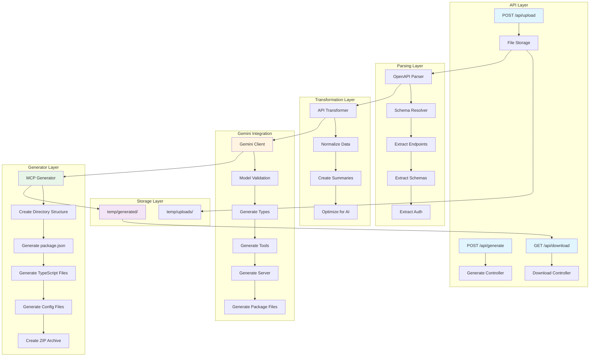

# AutoMCP: Automating MCP Server Generation with AI

## The Inspiration 💡

Creating MCP servers manually is tedious—writing boilerplate code, defining tool schemas, handling authentication. We asked: **what if we could automate this?**

AutoMCP bridges API documentation and AI agent integration. Developers upload OpenAPI/Swagger docs and get a production-ready MCP server in minutes, not hours.

## What We Learned 📚

**Prompt Engineering**: Structured, context-rich prompts with clear examples produce better code. We learned to break complex tasks into focused prompts (types → tools → server).

**Schema Resolution**: OpenAPI's `$ref` references create complex dependency graphs. We implemented recursive resolution with cycle detection to handle nested schemas.

**Error Resilience**: External APIs fail. We added retry logic, model validation, and auto-detection to gracefully handle Gemini API issues.

**Type Safety**: Generating TypeScript that compiles requires careful schema-to-type conversion and handling optional vs required parameters.

## How We Built It 🏗️

### Architecture

**1. Parsing Layer** (`src/parsers/`)
- OpenAPI 3.x parser (JSON/YAML)
- Extracts endpoints, parameters, schemas, auth schemes
- Recursive `$ref` resolution with cycle detection

**2. Transformation Layer** (`src/transformers/`)
- Normalizes data for AI consumption
- Reduces token usage while preserving context
- Creates endpoint summaries

**3. Gemini Integration** (`src/gemini/`)
- Multi-stage code generation:
  - Types → Tool Definitions → Implementations → Server
- Retry logic with exponential backoff
- Model validation and auto-detection
- Extracts code from markdown responses

**4. Package Generator** (`src/generators/`)
- Assembles complete npm package
- Generates `package.json`, `tsconfig.json`, config files
- Creates ZIP archive for distribution

**5. REST API** (`src/api/`)
- Express.js endpoints: upload, generate, download, status
- Local file storage with UUID sessions
- File upload handling with multer

### Tech Stack
- **TypeScript** + **Express.js**
- **Google Gemini AI** for code generation
- **js-yaml** for OpenAPI parsing
- **@modelcontextprotocol/sdk** for MCP protocol

## Challenges We Faced 🚧

**1. Model Availability**: `gemini-3.0-pro` didn't exist, `gemini-1.5-pro` wasn't available. **Solution**: Implemented model validation with fallback to `gemini-pro`.

**2. URL Construction**: Generated code used `new URL()` which failed with relative paths. **Solution**: Switched to string concatenation with trailing slash handling.

**3. Schema References**: Complex `$ref` graphs with potential cycles. **Solution**: Recursive resolution with visited set for cycle detection.

**4. Token Limits**: Large APIs exceeded limits. **Solution**: Multi-stage generation (types separately, tools individually).

**5. Type Safety**: Ensuring generated TypeScript compiles. **Solution**: Explicit schema-to-type conversion with proper annotations.

## Impact 🌟

- **Time Savings**: Hours → minutes for MCP server creation
- **Zero Boilerplate**: Eliminates repetitive code writing
- **Protocol Compliance**: Ensures MCP standards automatically
- **Production-Ready**: Generated code includes error handling, types, docs

## Future Enhancements 🚀

- Postman collection support
- Web UI dashboard
- Batch generation
- Cloud storage integration
- CI/CD templates

## Technical Highlights 🔬

**Performance**: Parallel tool generation, schema caching, lazy loading

**Security**: Path validation, file size limits, UUID sessions, input sanitization

**Code Quality**: TypeScript strict mode, comprehensive error handling, detailed logging

---

**Built in 2 hours with passion, powered by Gemini AI.**
